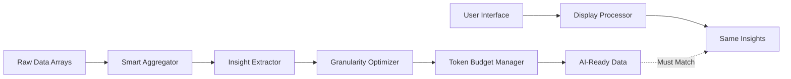

# AI Token Reduction Implementation Guide v2.0

## Next-Generation Intelligent Data Optimization

## Vision Statement

Transform raw data arrays into **intelligent analytical summaries** that preserve 100% of user-visible insights while achieving 95%+ token reduction. The AI should receive exactly what users see in tables and charts - no more, no less.

## Core Philosophy v2.0

### 1. **Perfect User-AI Alignment**

```
UI Display ≡ AI Input
```

Every metric, ratio, trend, and insight shown to users must be available to AI in structured format.

### 2. **Intelligent Granularity Management**

```
Time Range → Granularity → Token Budget
≤31 days   → Daily       → ~31 data points
≤6 months  → Weekly      → ~26 data points
>6 months  → Monthly     → ~12 data points
```

### 3. **Zero Information Loss Principle**

Replace **raw data volume** with **analytical density**:

- ❌ 10,000 transaction records = 2M tokens
- ✅ 30 daily summaries + trends = 5K tokens

## Implementation Architecture v2.0

### Data Flow Pipeline



### Core Components

#### 1. **Smart Data Aggregator**

```typescript
interface SmartAggregator<TRaw, TAggregated> {
    aggregate(rawData: TRaw[], granularity: Granularity): TAggregated[];
    preserveInsights(aggregated: TAggregated[]): AnalyticalInsights;
    validateIntegrity(insights: AnalyticalInsights, uiData: UIDisplayData): boolean;
}
```

#### 2. **Granularity Optimizer**

```typescript
interface GranularityOptimizer {
    determineOptimalGranularity(timeRange: DateRange, dataVolume: number): Granularity;
    estimateTokenUsage(data: any[], granularity: Granularity): number;
    enforceTokenLimits(data: any[], maxTokens: number): OptimizedData;
}
```

#### 3. **Insight Extractor**

```typescript
interface InsightExtractor {
    extractTrends(timeSeries: TimeSeriesData[]): TrendAnalysis;
    calculateRatios(financialData: FinancialData[]): RatioAnalysis;
    identifyAnomalies(data: any[]): AnomalyReport;
    summarizePerformance(data: any[]): PerformanceSummary;
}
```

## Section-Specific Implementation Patterns v2.0

### 🏦 Financial Analysis Sections

#### Data Structure Template:

```typescript
interface FinancialAnalysisData {
    viewContext: {
        selectedBranch: string;
        analysisPeriod: string;
        dataGranularity: 'monthly' | 'quarterly';
        periodsAnalyzed: number;
    };

    historicalFinancials: FinancialPeriod[];
    trendAnalysis: TrendAnalysis;
    ratioAnalysis: RatioAnalysis;
    performanceInsights: PerformanceInsights;
}

interface FinancialPeriod {
    period: string; // "2024-01"
    metrics: {
        revenue: number;
        cogs: number;
        grossProfit: number;
        opex: number;
        netIncome: number;
        ebitda: number;
    };
    ratios: {
        cogsPercent: string;    // "35.2%"
        gpmPercent: string;     // "64.8%"
        opexPercent: string;    // "45.1%"
        npmPercent: string;     // "19.7%"
        ebitdaPercent: string;  // "25.3%"
    };
    expenseBreakdown: {
        cogs: ExpenseCategories;
        opex: ExpenseCategories;
        nonOpex: ExpenseCategories;
    };
}

interface TrendAnalysis {
    revenuetrend: {
        direction: 'growing' | 'declining' | 'stable' | 'volatile';
        growthRate: string;     // "+15.2%"
        volatility: 'low' | 'medium' | 'high';
        seasonalPattern: string;
    };
    profitabilityTrend: {
        gpmTrend: 'improving' | 'declining' | 'stable';
        npmTrend: 'improving' | 'declining' | 'stable';
        efficiency: 'increasing' | 'decreasing' | 'stable';
    };
    costTrend: {
        cogsTrend: 'rising' | 'falling' | 'stable';
        opexTrend: 'rising' | 'falling' | 'stable';
        costControl: 'effective' | 'ineffective' | 'adequate';
    };
}
```

#### Implementation Pattern:

```typescript
const generateFinancialAnalysisData = (reports: PnLReport[]): FinancialAnalysisData => {
    // 1. Extract structured financial data
    const historicalFinancials = reports.map(extractFinancialMetrics);

    // 2. Perform trend analysis
    const trendAnalysis = analyzeTrends(historicalFinancials);

    // 3. Calculate ratio analysis
    const ratioAnalysis = analyzeRatios(historicalFinancials);

    // 4. Generate performance insights
    const performanceInsights = generatePerformanceInsights(historicalFinancials);

    return {
        viewContext: buildViewContext(reports),
        historicalFinancials,
        trendAnalysis,
        ratioAnalysis,
        performanceInsights
    };
};
```

### 💰 Sales Analysis Sections

#### Adaptive Granularity Implementation:

```typescript
interface SalesAnalysisData {
    viewContext: {
        selectedBranch: string;
        dateRange: string;
        granularity: 'daily' | 'weekly' | 'monthly';
        dataPoints: number;
    };

    timeSeriesData: SalesDataPoint[];
    summaryMetrics: SalesSummary;
    performanceAnalysis: PerformanceAnalysis;
    patternAnalysis: PatternAnalysis;
}

interface SalesDataPoint {
    period: string;
    metrics: {
        revenue: number;
        transactionCount: number;
        averageTransactionValue: number;
        customerCount?: number;
    };
    breakdown?: {
        hourlyDistribution: HourlyData[];
        channelDistribution: ChannelData[];
        productMix: ProductData[];
    };
}

interface PatternAnalysis {
    temporalPatterns: {
        peakHours: string[];           // ["12:00-14:00", "19:00-21:00"]
        peakDays: string[];            // ["Friday", "Saturday"]
        seasonalTrends: SeasonalData[];
    };
    performancePatterns: {
        highPerformancePeriods: PeriodData[];
        lowPerformancePeriods: PeriodData[];
        volatilityAnalysis: VolatilityData;
    };
    customerBehavior: {
        averageOrderSize: TrendData;
        transactionFrequency: TrendData;
        channelPreferences: ChannelPreferenceData[];
    };
}
```

#### Smart Granularity Logic:

```typescript
const optimizeSalesDataGranularity = (
    startDate: Date,
    endDate: Date,
    salesData: DailySalesSummary[]
): OptimizedSalesData => {
    const timeRange = calculateTimeRange(startDate, endDate);
    const granularity = determineOptimalGranularity(timeRange);

    switch(granularity) {
        case 'daily':
            return {
                granularity: 'daily',
                dataPoints: salesData.filter(inDateRange),
                tokenEstimate: estimateTokens(salesData.length * 150) // ~150 chars per daily record
            };

        case 'weekly':
            const weeklyData = aggregateToWeekly(salesData);
            return {
                granularity: 'weekly',
                dataPoints: weeklyData,
                tokenEstimate: estimateTokens(weeklyData.length * 200) // ~200 chars per weekly record
            };

        case 'monthly':
            const monthlyData = aggregateToMonthly(salesData);
            return {
                granularity: 'monthly',
                dataPoints: monthlyData,
                tokenEstimate: estimateTokens(monthlyData.length * 300) // ~300 chars per monthly record
            };
    }
};
```

### 🍽️ Product & Channel Analysis Sections

#### Performance-Focused Data Structure:

```typescript
interface ProductChannelAnalysisData {
    viewContext: {
        selectedBranch: string;
        analysisPeriod: string;
        productCount: number;
        channelCount: number;
        categoryCount: number;
    };

    productPerformance: ProductPerformanceData;
    channelAnalysis: ChannelAnalysisData;
    categoryInsights: CategoryInsightsData;
    trendAnalysis: ProductTrendData;
}

interface ProductPerformanceData {
    topPerformers: {
        byRevenue: ProductRanking[];
        byQuantity: ProductRanking[];
        byGrowth: ProductRanking[];
    };
    bottomPerformers: {
        byRevenue: ProductRanking[];
        declining: ProductRanking[];
        underperforming: ProductRanking[];
    };
    categoryAnalysis: {
        [category: string]: CategoryPerformance;
    };
}

interface ProductRanking {
    rank: number;
    name: string;
    category: string;
    revenue: number;
    quantity: number;
    averagePrice: number;
    marketShare: string;      // "15.2%"
    trend: 'rising' | 'falling' | 'stable';
    growthRate?: string;      // "+25.3%"
}

interface ChannelAnalysisData {
    channelDistribution: {
        [channel: string]: {
            revenue: number;
            marketShare: string;
            averageOrderValue: number;
            transactionCount: number;
            profitability: 'high' | 'medium' | 'low';
        };
    };
    channelTrends: {
        [channel: string]: {
            trend: 'growing' | 'declining' | 'stable';
            growthRate: string;
            seasonality: 'high' | 'medium' | 'low';
        };
    };
    crossChannelInsights: {
        mostProfitableChannel: string;
        fastestGrowingChannel: string;
        channelCannibalization: ChannelImpactData[];
    };
}
```

## Advanced Features v2.0

### 1. **Dynamic Token Budget Management**

```typescript
interface TokenBudgetManager {
    allocateTokens(sections: AnalysisSection[]): TokenAllocation;
    prioritizeData(data: any[], priority: DataPriority): OptimizedData;
    compressData(data: any[], compressionLevel: number): CompressedData;
    validateBudget(data: any[]): BudgetValidation;
}

const smartTokenAllocation = (analysisType: string, dataVolume: number): TokenBudget => {
    const baseBudget = 2000000; // 2M tokens per section

    return {
        maxTokens: baseBudget,
        reservedTokens: baseBudget * 0.1, // 10% buffer
        dataTokens: baseBudget * 0.8,     // 80% for data
        promptTokens: baseBudget * 0.1,   // 10% for prompt
        compressionRatio: calculateOptimalCompression(dataVolume)
    };
};
```

### 2. **Intelligent Data Prioritization**

```typescript
interface DataPriority {
    essential: string[];      // Must-have metrics
    important: string[];      // High-value metrics
    supplementary: string[];  // Nice-to-have metrics
    optional: string[];       // Lowest priority
}

const prioritizeFinancialData = (): DataPriority => ({
    essential: ['revenue', 'grossProfit', 'netIncome', 'cogsPercent', 'npmPercent'],
    important: ['opex', 'gpmPercent', 'revenueGrowth', 'profitabilityTrend'],
    supplementary: ['ebitda', 'opexPercent', 'seasonalPatterns'],
    optional: ['detailedExpenseBreakdown', 'quarterlyComparisons']
});
```

### 3. **Adaptive Compression Engine**

```typescript
interface CompressionEngine {
    compressTimeSeriesData(data: TimeSeriesData[], targetSize: number): CompressedTimeSeriesData;
    compressProductData(data: ProductData[], topN: number): CompressedProductData;
    compressFinancialData(data: FinancialData[], precision: number): CompressedFinancialData;
}

const adaptiveCompression = (data: any[], tokenBudget: number): CompressedData => {
    const currentSize = estimateTokenUsage(data);

    if (currentSize <= tokenBudget) {
        return { data, compressionRatio: 1.0 };
    }

    const requiredCompression = tokenBudget / currentSize;

    if (requiredCompression > 0.5) {
        // Light compression: Remove optional fields
        return lightCompression(data, requiredCompression);
    } else if (requiredCompression > 0.2) {
        // Medium compression: Aggregate + remove supplementary
        return mediumCompression(data, requiredCompression);
    } else {
        // Heavy compression: Keep only essential metrics
        return heavyCompression(data, requiredCompression);
    }
};
```

## Quality Assurance Framework v2.0

### 1. **Data Integrity Validation**

```typescript
interface DataValidator {
    validateFinancialData(aiData: FinancialData, uiData: UIFinancialData): ValidationResult;
    validateSalesData(aiData: SalesData, uiData: UISalesData): ValidationResult;
    validateProductData(aiData: ProductData, uiData: UIProductData): ValidationResult;
}

const comprehensiveValidation = (aiData: any, uiData: any): ValidationReport => {
    const validations = [
        validateMetricAccuracy(aiData.metrics, uiData.displayedMetrics),
        validateTrendConsistency(aiData.trends, uiData.chartTrends),
        validateRatioAccuracy(aiData.ratios, uiData.calculatedRatios),
        validateRankingConsistency(aiData.rankings, uiData.displayedRankings)
    ];

    return {
        overallScore: calculateValidationScore(validations),
        detailedResults: validations,
        criticalIssues: identifyCriticalIssues(validations),
        recommendations: generateImprovementRecommendations(validations)
    };
};
```

### 2. **Performance Monitoring**

```typescript
interface PerformanceMonitor {
    trackTokenUsage(sectionName: string, tokenCount: number): void;
    trackAnalysisQuality(sectionName: string, qualityScore: number): void;
    trackUserSatisfaction(analysisId: string, satisfaction: number): void;
    generatePerformanceReport(): PerformanceReport;
}

const realTimeMonitoring = {
    tokenUsage: new TokenUsageTracker(),
    analysisQuality: new QualityTracker(),
    systemPerformance: new PerformanceTracker(),

    alerts: {
        tokenUsageSpike: (usage: number, threshold: number) => usage > threshold,
        qualityDrop: (quality: number, baseline: number) => quality < baseline * 0.9,
        systemError: (errors: Error[]) => errors.length > 5
    }
};
```

### 3. **A/B Testing Framework**

```typescript
interface ABTestFramework {
    createExperiment(name: string, variants: ExperimentVariant[]): Experiment;
    runExperiment(experiment: Experiment, users: User[]): ExperimentResult;
    analyzeResults(results: ExperimentResult[]): AnalysisReport;
}

const experimentVariants = {
    compressionLevels: [
        { name: 'light', compressionRatio: 0.8 },
        { name: 'medium', compressionRatio: 0.5 },
        { name: 'heavy', compressionRatio: 0.2 }
    ],
    granularityStrategies: [
        { name: 'timeBasedOnly', strategy: 'time' },
        { name: 'volumeBasedOnly', strategy: 'volume' },
        { name: 'hybridApproach', strategy: 'hybrid' }
    ]
};
```

## Implementation Roadmap v2.0

### Phase 1: Foundation (Week 1-2)

- [ ] Implement core interfaces and type definitions
- [ ] Build Smart Data Aggregator for financial data
- [ ] Implement Granularity Optimizer for sales data
- [ ] Create Data Validator framework
- [ ] Set up performance monitoring

### Phase 2: Core Features (Week 3-4)

- [ ] Implement Insight Extractor for all data types
- [ ] Build Token Budget Manager
- [ ] Create Adaptive Compression Engine
- [ ] Implement data prioritization logic
- [ ] Add comprehensive validation

### Phase 3: Advanced Features (Week 5-6)

- [ ] Implement A/B testing framework
- [ ] Add real-time monitoring and alerts
- [ ] Create automated optimization
- [ ] Build performance analytics dashboard
- [ ] Implement predictive token usage

### Phase 4: Production Deployment (Week 7-8)

- [ ] Deploy to staging environment
- [ ] Run comprehensive testing
- [ ] Performance optimization
- [ ] Production deployment
- [ ] Monitor and iterate

## Success Metrics v2.0

### Technical Metrics

- **Token Reduction**: 95%+ reduction from raw data
- **Data Accuracy**: 99.9% match between AI and UI data
- **Performance**: <2 second data processing time
- **Reliability**: 99.9% uptime with no token errors

### Business Metrics

- **Analysis Quality**: AI insights quality score >90%
- **User Satisfaction**: User feedback score >4.5/5
- **Business Value**: Actionable insights per analysis >5
- **Cost Efficiency**: AI API costs reduced by 95%

### Operational Metrics

- **Monitoring Coverage**: 100% of sections monitored
- **Alert Response**: <1 minute alert response time
- **System Health**: <1% error rate across all sections
- **Scalability**: Support for 10x data volume increase

## Innovation Opportunities

### 1. **AI-Powered Data Summarization**

Use smaller AI models to pre-process raw data into intelligent summaries before sending to analysis AI.

### 2. **Predictive Token Usage**

Machine learning models to predict optimal compression ratios based on data characteristics.

### 3. **Dynamic Prompt Optimization**

Automatically optimize prompts based on data characteristics and token budget.

### 4. **Semantic Data Compression**

Use semantic understanding to preserve meaning while reducing token count.

This v2.0 approach transforms token reduction from a simple compression problem into an intelligent data optimization challenge, delivering better insights with dramatically reduced costs.
